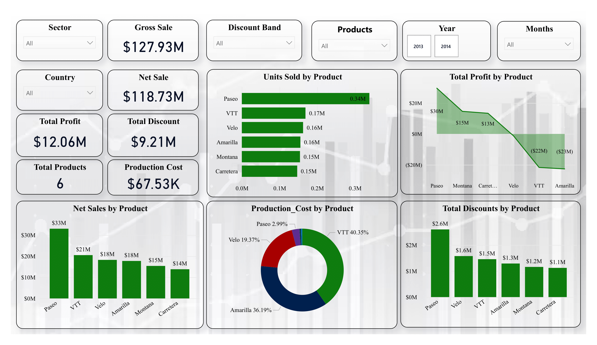

## Table of Contents

- [Contributors](#contributors)
- [Company A Financials Data Analysis](#company-a-financials-data-analysis)
    - [Overview](#overview)
    - [Key Metrics Analyzed](#key-metrics-analyzed)
    - [Segments Analyzed](#segments-analyzed)
    - [Visualizations](#visualizations)
- [Insights](#insights)
    - [Product Sales Analysis](#product-sales-analysis)
    - [Country Sales Analysis](#country-sales-analysis)
    - [Sector Sales Analysis](#sector-sales-analysis)
    - [Monthly Sales Analysis](#monthly-sales-analysis)
    - [Production Cost and Discounts](#production-cost-and-discounts)
    - [Recommendations](#recommendations)
        - [Optimize Product Focus](#optimize-product-focus)
        - [Reevaluate Discounts](#reevaluate-discounts)
        - [Reduce Costs](#reduce-costs)
        - [Expand in Profitable Markets](#expand-in-profitable-markets)
        - [Boost Low Sales Months](#boost-low-sales-months)
        - [Sector Strategy](#sector-strategy)
    - [Conclusion](#conclusion)
- [Inspiration from Jude Foundation Scholarship Students](#inspiration-from-jude-foundation-scholarship-students)
- [Some DAX Functions Used](#some-dax-functions-used)

# Contributors

1. Isaac - Zac001-spec
2. Roseline - Rose-of-web3
3. Sandra - chimdiasogwa

# Company A Financials Data Analysis


This data provides a detailed analysis of the financial performance of Company A, with a focus on key financial metrics, including revenue, profit, cost of goods sold (COGS), and sales performance across different segments, countries, and products. The analysis is visualized using Power BI, offering insights into trends and patterns that drive the company's financial health.

### Overview

**Objective:** To analyze the financial data of Company A, identify trends, and generate insights that can help in strategic decision-making.
**Data Source:** The financial data used in this report is sourced from Company A's internal systems, capturing transactions and financial activities over a specific period.

### Key Metrics Analyzed

**Revenue:** Total income generated from sales of goods or services before any expenses are deducted.
**Profit:** The financial gain after subtracting the cost of goods sold and other expenses from the revenue.
**Cost of Goods Sold (COGS):** The direct costs attributable to the production of the goods sold by the company.
**Units Sold:** The total quantity of products sold within the specified period.

### Segments Analyzed

**Government Segment:** Analysis of financial performance for sales made to government entities.
**Country-Level Analysis:** Financial performance segmented by country, highlighting the performance in different geographic regions such as Canada and Germany.
**Product-Level Analysis:** Analysis of sales and profitability by product category, focusing on high-performing products like "Carretera."

### Visualizations

**Dashboards:** The Power BI dashboards provide a visual representation of the key metrics, enabling a quick understanding of the company's financial performance.
Sales Performance Dashboard: Shows overall sales, revenue, and profit margins by segment, country, and product.
**Profitability Analysis Dashboard:** Focuses on COGS and profit margins, highlighting areas where the company is performing well or needs improvement.

# Insights

### Product Sales Analysis

Paseo leads with 0.34 million units sold and $33 million in net sales, but its profitability is hindered by high production costs (2.99%) and $2.6 million in discounts. In contrast, VTT and Amarilla, despite respectable sales, suffer from negative profits of $22 million and $23 million respectively, largely due to high production costs (40.35% for VTT and 36.19% for Amarilla) and significant discounting.

### Country Sales Analysis

The United States and Canada lead in net sales with 21.08% and 20.96% respectively, but their profits are not proportionately high due to substantial discounts offered, totaling $2.2 million for the USA and $2.0 million for Canada. In contrast, Germany achieves the highest total profit of $3.26 million, supported by moderate production costs and discount levels.

### Sector Sales Analysis

The Government sector leads in gross sales with $56.4 million but generates low profits. Conversely, the Small Business sector, while having the second-highest net sales at $45.94 million, boasts a higher profit margin, making it a more profitable focus than the Government sector.

### Monthly Sales Analysis

October is the peak sales month, generating $21.7 million in sales. However, there is a significant decline in sales by March, which recorded only $5.6 million. Analyzing seasonality and market demand trends could provide insights to help stabilize sales throughout the year.

### Production Cost and Discounts

High production costs are evident in VTT (40.35%) and Amarilla (36.19%), resulting in low profitability; therefore, a cost reduction strategy is recommended. Additionally, Paseo has the highest discount at $2.6 million, suggesting that reassessing discount strategies across all products could substantially improve profit margins.

### Recommendations

##### Optimize Product Focus

Prioritize profitable products like Paseo while working to reduce costs and discounts for VTT and Amarilla.

##### Reevaluate Discounts

Adjust discount strategies to improve profit margins, particularly for products like Paseo with $2.6M in discounts.

##### Reduce Costs

Focus on reducing high production costs for VTT (40.35%) and Amarilla (36.19%).

##### Expand in Profitable Markets

Leverage strong performance in Germany ($3.26M profit) to explore and expand in similar markets.

##### Boost Low Sales Months

Implement targeted promotions or new product launches to increase sales during low-performing months like March ($5.6M in sales).

##### Sector Strategy

Focus on the Small Business sector, which is generating $45.94M in net sales with a healthy profit margin. Reconsider strategies for the Government and Channel Partners sectors to enhance profitability.

### Conclusion

The data highlights key areas for improvement in profitability. Paseo is a strong seller but needs cost and discount optimization. VTT and Amarilla are underperforming due to high costs and discounts, requiring immediate attention. Germany is the most profitable market, indicating the potential for expansion, while the Government sector needs a strategy review despite its high sales. Addressing these areas and stabilizing seasonal sales can drive sustainable growth and maximize profits.

# Inspiration from Jude Foundation Scholarship Students

This analysis and report were inspired by the students of the Jude Foundation Scholarship, who contributed significantly to the project by applying their data analysis skills. Their work helped in creating insightful visualizations and identifying key trends in the data.

# Some DAX Functions Used

`Target Sales = 230000;`

```
NairaSalesColumn =
    FORMAT([ Sales],"₦#,##0.00");
```





[My URL Shortner](https://url-shortener-psi-amber.vercel.app/)
<br>
[My URL Shortner](https://url-shortener-psi-amber.vercel.app/)
